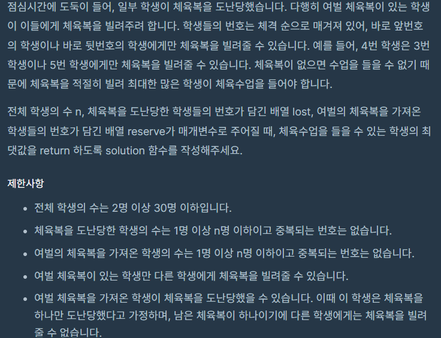
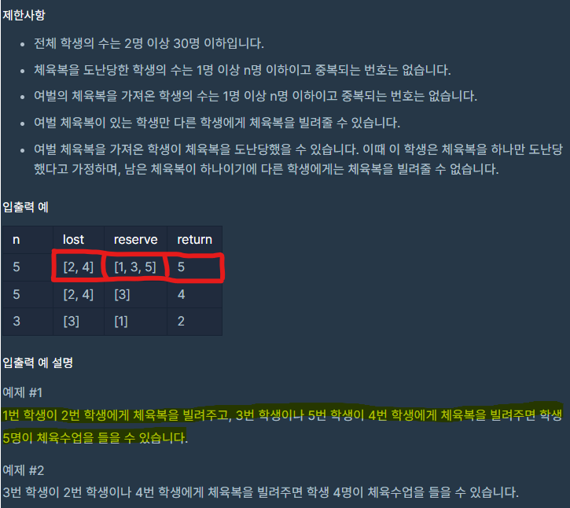

# [✏️프로그래머스 문제 풀러 가기!](https://school.programmers.co.kr/learn/courses/30/lessons/42862)
<br>

 



<br>
<br>
<br>

```python
def solution(n, lost, reserve): 
    
    set_reserve = set(reserve)-set(lost)  # 여벌이 있으면서 도난 안당한 학생들
    set_lost = set(lost)-set(reserve)   # 체육복이 필요한 학생
    
    for i in set_reserve: # 여분 체육복으로 반복문
      # 체육복이 필요한데 체육복이 있다면, 진짜 체육복이 필요한 학생은 i-1, i+1

        if i-1 in set_lost: 
            set_lost.remove(i-1) 
				# 현재 학생의 번호보다 하나 적은 번호를 가진 학생이 '도난당한 학생 목록'에 있다면 그 학생에게 체육복 빌려줌 
            
        elif i+1 in set_lost: 
            set_lost.remove(i+1) 
				# 현재 학생의 번호보다 하나 많은 번호를 가진 학생이 그 리스트에 있다면 그 학생에게 체육복 빌려줌

    return n - len(set_lost)
    # 전체 - 체육복 필요한 학생 == 체육 수업 들을 수 있는 학생들
```

<br>

# 잠깐!

`set(lost)` 랑 `set(reserve)` 왜 사용했냐?
    
    —> 각 학생의 체육복 도난 여부, 여벌 체육복 여부를 중복 없이 나타내기 위해